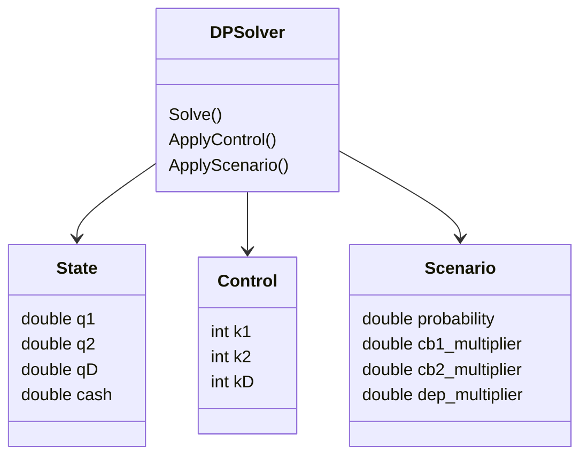

---

# Отчёт по задаче динамического программирования для управления инвестиционным портфелем

## Выполнил: Фёдоров Иван, К3340

---

## **1. Цель работы и постановка задачи**

Целью данной лабораторной работы является изучение и практическое применение метода динамического программирования для решения задачи оптимального пошагового управления инвестиционным портфелем в условиях неопределённости.

Рассматривается портфель, состоящий из трёх видов активов и свободных денежных средств:

| Компонент портфеля    | Начальный объём (д.е.) |
| --------------------- | ---------------------- |
| Ценная бумага 1 (ЦБ1) | 100                    |
| Ценная бумага 2 (ЦБ2) | 800                    |
| Депозит               | 400                    |
| Денежные средства     | 600                    |

Управление осуществляется на трёх временных этапах. На каждом этапе инвестор может купить или продать активы фиксированными пакетами:

* ЦБ1 — 25 д.е.
* ЦБ2 — 200 д.е.
* Депозит — 100 д.е.

При совершении операций взимается комиссия:

* ЦБ1 — 4%;
* ЦБ2 — 7%;
* депозит — 5%.

Рыночная динамика моделируется тремя возможными сценариями (благоприятный, нейтральный, неблагоприятный) с заданными вероятностями и коэффициентами изменения стоимости активов.

**Задача** состоит в нахождении оптимальной стратегии управления портфелем, максимизирующей математическое ожидание итоговой стоимости активов по критерию Байеса.

---

## **2. Общая математическая формулировка задачи динамического программирования**

Процесс управления рассматривается как многошаговая стохастическая задача принятия решений на конечном горизонте времени
( t = 1, 2, 3 ).

### Основные обозначения

* ( x_t ) — состояние системы перед этапом ( t );
* ( u_t ) — управленческое решение, принимаемое на этапе ( t );
* ( \xi_t ) — случайное событие, описывающее сценарий изменения рынка;
* ( f_t(x_t, u_t, \xi_t) ) — функция перехода системы в следующее состояние.

### Целевая функция

Требуется максимизировать математическое ожидание итоговой стоимости портфеля:

```math
\max_{u_1,\dots,u_T} \mathbb{E}[F(x_{T+1})].
```

---

## **3. Рекуррентное соотношение Беллмана**

Для формализации задачи вводится функция ценности Беллмана:

```math
V_t(x) = \max_{u_t,\dots,u_3} \mathbb{E}[F(x_4)\mid x_t = x].
```

Граничное условие задаётся на последнем шаге:

```math
V_4(x) = F(x),
```

где ( F(x) ) — итоговая стоимость портфеля.

Рекуррентное соотношение Беллмана для общего случая имеет вид:

```math
V_t(x) = \max_{u \in U_t(x)}
\sum_{j=1}^{3} p_{t,j} \cdot V_{t+1}\bigl(f_t(x, u, \omega_j)\bigr).
```

Оптимальное управление определяется выражением:

```math
u_t^*(x) = \arg\max_{u \in U_t(x)}
\sum_j p_{t,j} V_{t+1}(f_t(x,u,\omega_j)).
```

### Описание алгоритма

* **Обратный проход** выполняется от последнего этапа к первому и предназначен для вычисления функции ценности и оптимальных управлений.
* **Прямой проход** используется для восстановления оптимальной стратегии, начиная с начального состояния системы.

---

## **4. Постановка конкретной задачи**

### Состояние системы

Состояние портфеля на этапе ( t ) описывается вектором:

```math
x_t = (q_{1,t}, q_{2,t}, q_{D,t}, c_t),
```

где:

* ( q_{1,t} ) — объём инвестиций в ЦБ1;
* ( q_{2,t} ) — объём инвестиций в ЦБ2;
* ( q_{D,t} ) — сумма средств на депозите;
* ( c_t ) — свободные денежные средства.

### Управление

```math
u_t = (k_{1,t}, k_{2,t}, k_{D,t}),
```

где каждое ( k ) — целое число пакетов, соответствующее покупке или продаже актива.

### Ограничения

1. Запрещено использование заёмных средств:

```math
c_t^{after} \ge 0.
```

2. Объёмы активов не могут быть отрицательными.
3. Все операции учитывают комиссионные издержки.

### Переход системы

После применения управления и реализации сценария рынок изменяет стоимость активов с использованием заданных коэффициентов, при этом денежные средства остаются неизменными.

---

## **5. Основной алгоритм решения задачи**

Алгоритм динамического программирования включает следующие шаги:

1. Инициализация конечной функции ценности.
2. Последовательный обратный проход по этапам:

   * перебор допустимых управлений;
   * проверка ограничений;
   * вычисление математического ожидания;
   * выбор оптимального решения.
3. Прямой проход для восстановления оптимальной стратегии управления.
4. Вывод полученных результатов.

(Алгоритм представлен также в виде блок-схемы.)

---

## **6. Диаграмма классов программы**



---

## **7. Демонстрационные примеры работы программы**

В результате выполнения программы формируется оптимальная стратегия управления портфелем. Пример вывода:

```text
Этап 1: (k1, k2, kD) = (1, 1, 1)
Этап 2: (k1, k2, kD) = (-1, 0, 0)
Этап 3: (k1, k2, kD) = (0, 0, 0)

Максимальное ожидаемое значение целевой функции:
V₁ = 2025.14 д.е.
```

Также отображаются ожидаемые состояния портфеля после каждого этапа.

---

## **8. Заключение**

В рамках данной работы была рассмотрена и решена задача оптимального управления инвестиционным портфелем с использованием метода динамического программирования.

В ходе выполнения лабораторной работы:

* была сформулирована математическая модель стохастического управления;
* выведено рекуррентное соотношение Беллмана;
* реализован алгоритм обратного и прямого проходов;
* разработана программная реализация на языке Python;
* получена оптимальная стратегия по критерию Байеса;
* рассчитано максимальное ожидаемое значение итоговой стоимости портфеля.

В результате выполнения работы удалось закрепить навыки построения динамических моделей, анализа многокритериальных задач в условиях неопределённости и практического применения методов оптимизации.

---
